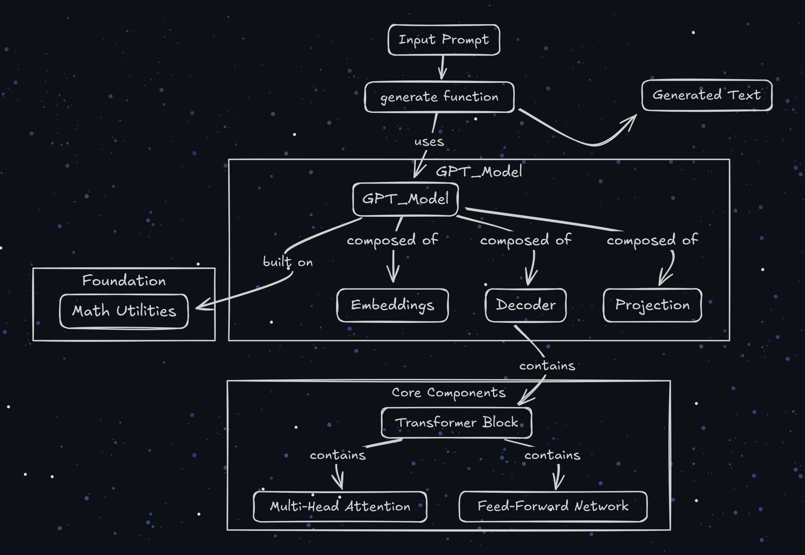

# The Hitchhiker's Guide to the GPT-2 Galaxy
This is your complete star-chart for an entire text-generating universe, meticulously mapped from the most fundamental particles of logic: **pure Python** and **raw mathematics**.

**No NumPy. No PyTorch.** Just the elegant, un-magical machinery of a transformer, laid bare for the intrepid explorer.

Remember: **DON'T PANIC.** You have the full map now.



---

This repository is a complete, functional implementation of the GPT-2 language model. It's not a toy or a simplified version; it's an exact, verifiable replica built without the high-level abstractions of modern ML frameworks. It's an expedition into the mathematical core of what makes these models tick.

### The Prime Directives of This Expedition

*   **Charted in Pure Maths:** The entire model engine, located in the `src/` directory, is built with nothing but Python's standard library. Every matrix multiplication, every activation function, and every normalization layer is written from scratch, revealing the raw algorithms at work.
*   **A Perfect Replica:** This isn't just an approximation. This implementation is rigorously tested to be a bit-for-bit match with industry-standard libraries. The `compare.py` script verifies every single component against its NumPy and PyTorch equivalent.
*   **Fully Functional & Compatible:** This model can load the official, pre-trained weights from Hugging Face's `gpt2` and generate text, proving its compatibility and correctness. You can see the universe, and you can also fly the ships built by others.

### Navigating the Cosmos: Project Structure

This galaxy is organized into several key star systems, each housed in the `src/` directory:

*   `src/utils/`: The laws of physics. Contains the fundamental mathematical operations like `matrix_multiply`, `softmax`, and `layer_norm` that govern the entire universe.
*   `src/embeddings/`: The genesis forge. This is where abstract token IDs are given physical form as vectors, and where their position in spacetime is imprinted upon them.
*   `src/layers/`: The galactic factories. Home to the powerful, self-contained modules like `multi_head_attention` and `transformer_block` that process and refine information.
*   `src/model/`: The galactic core. Here, all the layers and components are assembled into the final, cohesive `gpt_model`, orchestrating the flow of data from prompt to prose.

### Firing Up the Improbability Drive: How to Run

First, you'll need to install the necessary tools for verification and interfacing with the outside universe.

```bash
pip install -r requirements.txt
```

#### 1. Verifying the Map (`compare.py`)
This script is your proof that the map is accurate. It runs every single function in our `src` library and compares its output against a reference implementation from NumPy or PyTorch.

```bash
python compare.py
```

You should see a cascade of success messages, confirming that our from-scratch components are perfect replicas:

```
--- Testing Utils ---
Matrix multiplication results match!
Add matrices results match!
...
--- Testing Full GPT Model Forward Pass ---
GPT model forward pass results match!
...
Generation test complete! (Output is random as weights are not trained)
```

#### 2. Visiting a Pre-existing Galaxy (`run_gpt2.py`)
This is the "wow" moment. This script downloads the official `gpt2` weights from Hugging Face, painstakingly maps them onto our custom model structure, and then generates text.

```bash
python run_gpt2.py
```

This proves our model isn't just correct in theory, it's fully compatible with the real thing.

**Example Output:**
```
Loading pre-trained GPT-2 model from Hugging Face...
Initializing our custom model structure...
Mapping pre-trained weights to our structure...
Weight mapping complete!
--------------------------------------------------
Prompt: 'Once upon a time'
Encoded IDs: [7454, 2402, 257, 640]
Generating text with loaded GPT-2 weights...
--------------------------------------------------
Generated IDs: [7454, 2402, 257, 640, 11, 428, 373, 674, 6000]
Generated Text: 'Once upon a time, this was our greatest'
--------------------------------------------------
```

---

And there you have it. The entire GPT-2 galaxy, charted and demystified. You now possess the complete map, from the smallest mathematical quarks to the final, text-generating quasar. Grab your towel, the journey from here is up to you.
